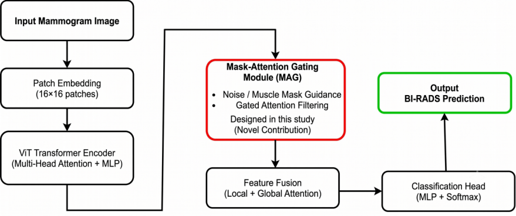
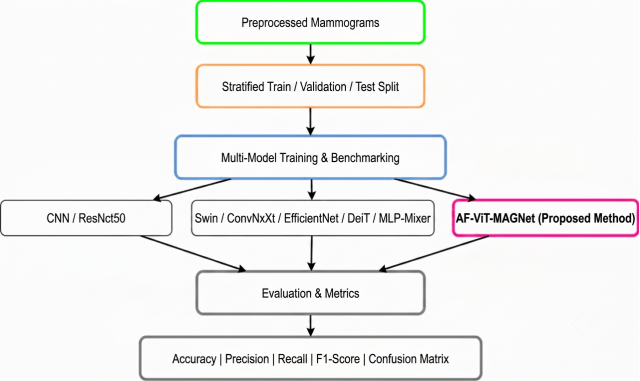

# AF-ViT-MAGNet: Adaptive-Fusion Vision Transformer for Breast Cancer Classification

An Adaptive-Fusion Vision Transformer featuring a novel **Mask-Attention Gating Module (MAG)** for multi-model breast cancer classification and BI-RADS risk prediction on screening mammograms[cite: 3].

## 🔬 Research Context
This repository contains the core classification architecture developed during a six-month research internship in Medical Image Analysis and Deep Learning[cite: 3]. The proposed framework integrates spatial mask-guided attention to focus transformer feature extraction on breast tissue while suppressing non-breast structures and acquisition artifacts[cite: 3].

The associated manuscript is currently under review.

## 🚀 Key Architectural Contributions
* **Mask-Attention Gate (MAG):** Spatial gating module that modulates transformer attention maps using segmentation priors[cite: 3].
* **Multi-Aggregation Feature Fusion:** Combines patch-level self-attention with global contextual representation[cite: 3].
* **Multi-Model Benchmarking Suite:** Standardized comparison harness covering CNNs (ResNet50, ConvNeXt), Transformers (ViT, Swin, DeiT), and MLP-Mixer[cite: 3].
* **Patient-Wise Stratified Partitioning:** Leakage-free train/validation/test splitting ensuring robust clinical evaluation[cite: 3].

## 🏗️ Architecture


Input Mammogram ──> Patch Embedding ──> ViT Transformer Encoder ──> Mask-Attention Gate (MAG) ──> Feature Fusion ──> BI-RADS Prediction

## 🔄 Multi-Model Benchmarking Pipeline


## 📂 Repository Layout
```text
src/
├── models.py       # AF-ViT-MAGNet & benchmark baseline architectures (ResNet, Swin, ConvNeXt, ViT)
├── dataset.py      # PyTorch Dataset interface for clean mammograms
├── trainer.py      # Decoupled training loop with AdamW and ReduceLROnPlateau
├── losses.py       # Classification loss with segmentation regularization
├── metrics.py      # Multi-class Accuracy, Precision, Recall, and F1 evaluation
├── inference.py    # Model loading & single-image prediction pipeline
└── utils.py        # Reproducibility seeds and utility routines
```

🛠️ Usage
```
Python
from src.inference import predict_single_image

# Predict BI-RADS risk category for a preprocessed mammogram
result = predict_single_image(
    model_path="path/to/checkpoint.pth",
    image_path="path/to/clean_mammogram.png",
    model_name="af_vit_magnet"
)

print("Predicted BI-RADS Class:", result["predicted_class"])
print("Class Probabilities:", result["probabilities"])
```

📊 Experimental Performance
Refer to the docs/ folder for comprehensive multi-model training loss curves and performance comparison charts[cite: 3].

docs/loss_curves.png: Loss convergence curves across all 9 benchmarked architectures[cite: 3].

docs/performance_chart.png: Comparative bar chart (Accuracy, Precision, Recall, F1-Score)[cite: 3].

🛠️ Technologies
Python

PyTorch

Torchvision

Scikit-Learn

Seaborn & Matplotlib